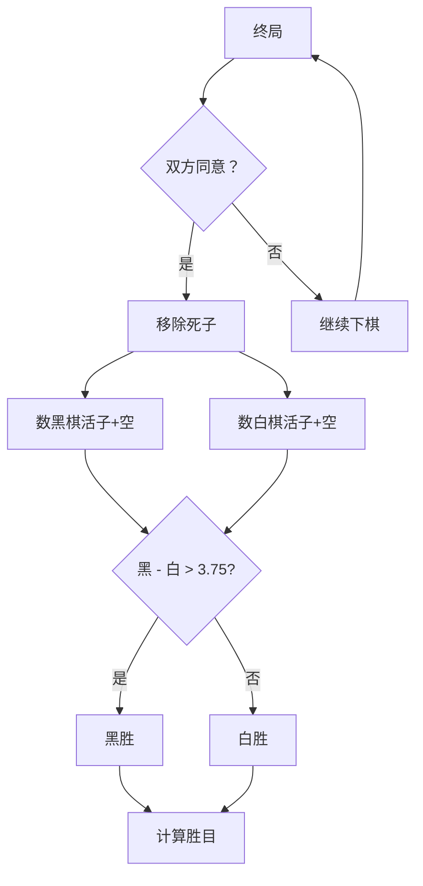

中国围棋竞赛规则

版本：v2.0 | 适用范围：世界级赛事 | 最后更新：2024年

 一、基础规则

1.1 棋子

```yaml
颜色: 黑、白
各棋盘棋子数量配置:
19x19: 黑181枚，白180枚，
13x13: 黑85枚，白84枚，
9x9:   黑41枚，白40枚。
先后: 黑方先行，双方轮流
```

 二、核心规则详解

2.1 气的定义

```
气 = 与棋子直线紧邻的空交叉点

计算规则:
- 直线上相邻（上下左右）才算气
- 斜角相邻不算气
- 多个同色棋子共享气
- 被对方棋子包围的气不算
```

2.2 提子规则

```
当棋子（或棋子块）的气 = 0 时，立即从棋盘上移除

提子优先级:
1. 落子后检查对方棋子
2. 再检查己方棋子
3. 同时无气时，只提对方（禁自杀）
```

2.3 禁着点

```prolog
禁止落子的情况:
1. 落子后己方棋子无气（除非提子）
2. 违反劫争规则
3. 落在已有棋子的交叉点
```

 三、劫争规则

3.1 基本劫

```yaml
定义: 双方轮流提对方一子的循环局面

规则: 
- 被提劫方不得立即回提
- 必须先在别处下一手
- 对方应劫后，才能回提
```

3.2 特殊劫

```yaml
长生劫: 
- 循环出现相同局面
- 判为无胜负（需加赛）

循环劫:
- 多个劫同时存在
- 按基本劫规则分别处理

假生:
- 看似能活，实则必死
- 按实战解决
```

 四、死活判定

4.1 活棋条件

```python
def is_alive(group):
    """
    活棋判断标准
    """
    # 条件1：有两个真眼
    if count_real_eyes(group) >= 2:
        return True
    
    # 条件2：双活（特殊）
    if is_seki(group):
        return True
    
    # 条件3：可以做出两眼
    if can_make_two_eyes(group):
        return True
    
    return False
```

4.2 真眼与假眼

```yaml
真眼条件:
1. 眼的四个角点中，至少三个被己方占据
2. 边上的眼：两个角点被占据
3. 角上的眼：一个角点被占据

假眼特征:
- 缺少必要的角点
- 对方可以点入
- 最终会被提掉
```

4.3 双活（公活）

```yaml
定义: 双方互相包围，均无法杀死对方

特征:
- 共享公气
- 谁先紧气谁死
- 终局时双方存活
```

⚖️ 五、终局与胜负计算

5.1 终局条件

```yaml
正常终局:
1. 双方连续弃权（Pass）
2. 一方认输
3. 超时判负

特殊情况:
- 无胜负（三劫循环等）
- 双方同意终局
```

5.2 数子法（中国规则）

【黑白胜负的数学定义】

设终局后数子，黑方得点为B，白方得点为W，棋盘总点数为T，贴目为K

则：
黑胜 ⇔ B ≥ T/2 + K
白胜 ⇔ B ≤ T/2 - K

具体数值：
19x19: T/2 = 180.5, K = 3.75
  黑胜 ⇔ B ≥ 184.25 → 整数判定 B ≥ 185
  白胜 ⇔ B ≤ 176.75 → 整数判定 B ≤ 184

13x13: T/2 = 84.5, K = 3.25
  黑胜 ⇔ B ≥ 87.75 → 整数判定 B ≥ 88
  白胜 ⇔ B ≤ 81.25 → 整数判定 B ≤ 87

9x9: T/2 = 40.5, K = 2.75
  黑胜 ⇔ B ≥ 43.25 → 整数判定 B ≥ 44
  白胜 ⇔ B ≤ 37.75 → 整数判定 B ≤ 43

```python
def calculate_score(board, black_prisoners, white_prisoners):
    """
    中国规则数子法
    """
    # 贴目：黑棋贴给白棋 3又3/4子（7.5目）
    KOMI = 3.75
    
    # 1. 计算双方活棋围的空点
    black_territory = count_territory(board, 'black')
    white_territory = count_territory(board, 'white')
    
    # 2. 加上棋盘上的活子
    black_stones = count_stones(board, 'black')
    white_stones = count_stones(board, 'white')
    
    # 3. 总得分
    black_score = black_stones + black_territory
    white_score = white_stones + white_territory
    
    # 4. 计算胜负（黑棋需要超过 180.5 + 3.75 = 184.25）
    if black_score - white_score > KOMI:
        return "黑胜", black_score - white_score - KOMI
    else:
        return "白胜", white_score - black_score + KOMI
```

5.3 死子确认

```yaml
终局后确认死子:
1. 双方一致同意：直接移除
2. 有争议：继续下棋解决
3. 实战解决后，重新数子
```

 六、特殊局面处理

6.1 让子棋规则

```yaml
让子数: 2-9子不等
贴目: 黑棋不贴目，白棋收后
让子位置: 固定星位
```

6.2 超时规则

```yaml
基本时限: 每方3小时
读秒: 60秒3次（60秒内必须落子）
超时判负: 读秒用完
```

6.3 犯规处理

```yaml
落子犯规:
- 第一次：警告 + 罚1子
- 第二次：判负

移动棋子: 立即判负

悔棋: 不允许
```

 七、胜负判定流程图



 八、SGF记录标准

```yaml
文件头:
  GM[1]      # 围棋
  FF[4]      # SGF版本
  SZ[19]     # 棋盘大小
  KM[7.5]    # 贴目（3又3/4子）
  RU[Chinese]# 中国规则
  HA[0]      # 让子数

对局信息:
  PB[棋手名] # 黑方
  PW[棋手名] # 白方
  RE[结果]   # 如 B+R（黑中盘胜）
  DT[日期]   # 对局日期
  EV[赛事名] # 赛事名称

落子记录:
  ;B[位置]   # 黑棋落子
  ;W[位置]   # 白棋落子
  ;B[]       # 弃权
```

 九、AI训练要点

9.1 规则优先级

```python
RULES_PRIORITY = [
    "禁着点检查",      # 最高优先级
    "劫争规则",        # 次高
    "提子规则",        # 
    "死活判定",        #
    "终局条件",        #
    "胜负计算",        # 最低
]
```

9.2 常见误区提醒

```yaml
容易犯的错误:
1. 忽略劫争: 必须记住劫的位置
2. 自杀判断: 必须先提对方再检查自杀
3. 假眼识别: 看似眼实则是假眼
4. 双活判定: 共享公气时双方都活
5. 贴目计算: 黑棋184.25子胜／白棋176.75子胜
```

9.3 规则测试用例

```python
TEST_CASES = [
    {
        "name": "基本劫",
        "position": "...",
        "expected": "不能立即回提"
    },
    {
        "name": "双活",
        "position": "...", 
        "expected": "双方存活"
    },
    {
        "name": "盘角曲四",
        "position": "...",
        "expected": "劫活"
    }
]
```

---